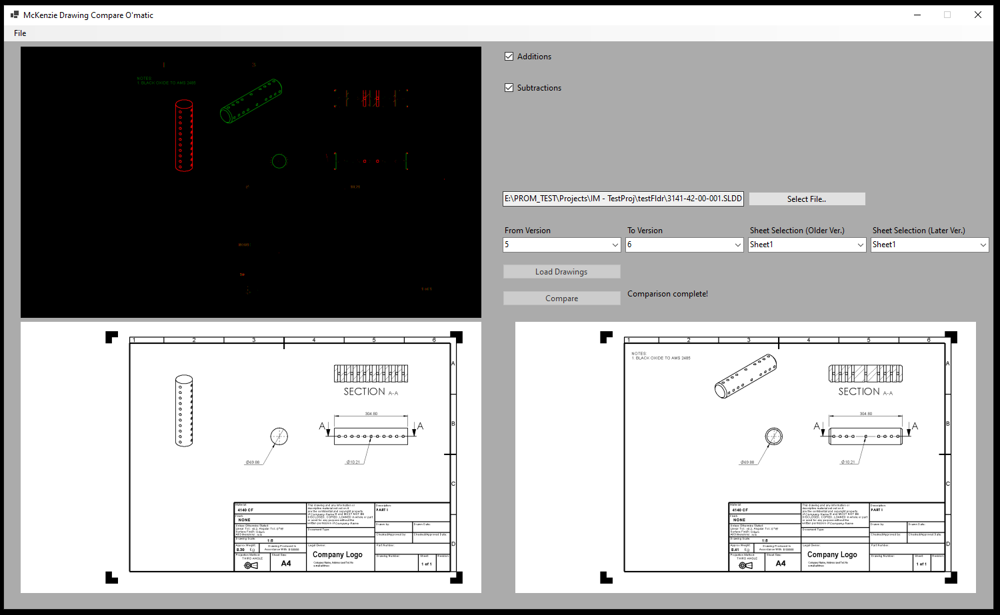
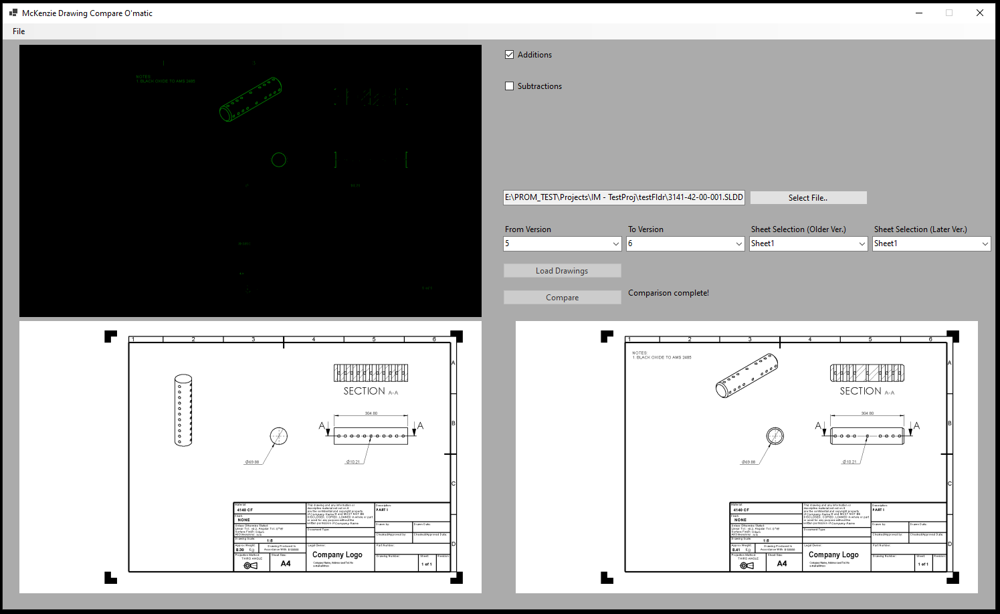
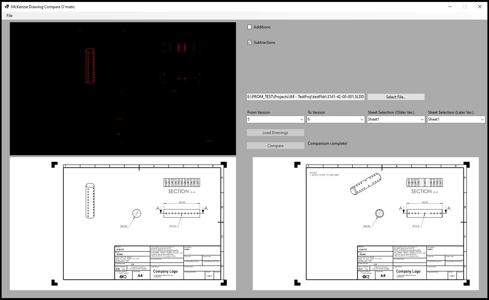
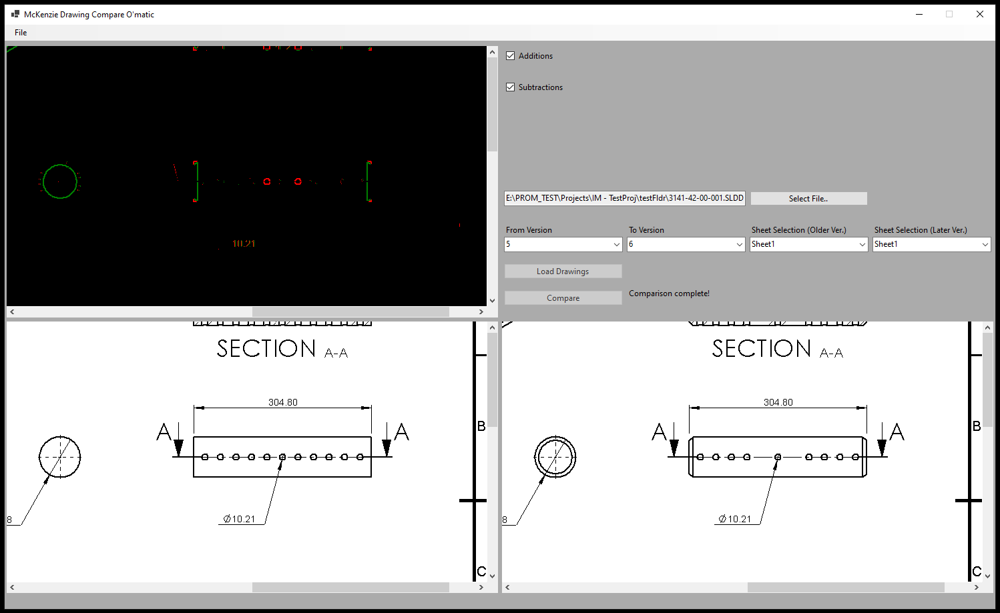
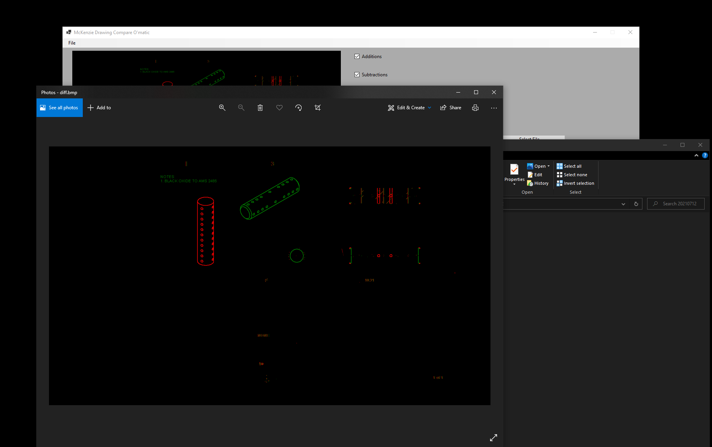

This is an MS Forms app I created with C# that uses SW APIs to compare across versions of a vaulted drawing. The program first creates bitmap images of the drawing's sheets (stored in a temp folder) and then does a pixel-comparison between the older and newer drawing versions. 

Once the user has selected the drawing and versions, loaded the bitmaps, and clicked compare, they are presented with a screen like this: 

As you can see, the features which have changed between the two versions are highlighted - they can also be selectively hidden so you could choose to only see green for additions:

or red for subtractions:

(there are occasionally some artifacts that randomly occur when the SW API decides to shift the drawing for some unknown reason.. I might be able to correct for that, but it works consistently well enough that I haven't felt the need to)

Also, if the user wants to view a larger version of the comparison, I've set up the ability to double-click the difference bitmap in order to change to a zoomed-in scrollable picture window. While scrolling on the difference bitmap, the scroll bars on the source bitmaps synchronize with the viewed position on the difference bitmap. 

Once the difference bitmap is created, there is an option in the File menu to save it to disk, so it can be emailed, marked-up, or otherwise used outside the app. 

